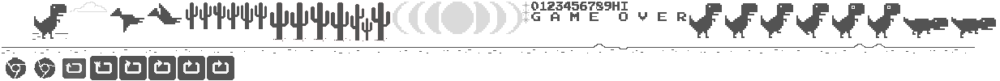
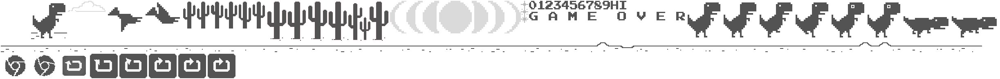

::: {.nui-pagehead}
[Interaktiv · Spielbar]{.nui-eyebrow}

::: {.nui-lead}
Auf dieser Seite probieren wir die [Methode](methode.qmd) aus: mit
Live-Skelett-Overlay, zwei kleinen Modulen und dem per Hand oder Körperpose
gesteuerten **Chrome-T-Rex**. Die Kamera startest du im **NUI-Dock unten rechts**.
Sie läuft *on-device*, nichts verlässt dein Gerät. Maus und Tastatur funktionieren
weiterhin.
:::
:::

## Live-Skelett-Overlay {#interaktiv}

Die erste interaktive Visualisierung ist das **Live-Skelett-Overlay**. Im
Kamerabild zeichnet ein Canvas die von *MediaPipe* erkannten **Landmarks als
Knoten und Kanten** nach: 21 Punkte pro Hand bzw. ein Ganzkörper-Skelett aus den
33 Pose-Landmarks. **Blaue** Knoten und Kanten stehen für *sicher erkannt*,
**rote** für *unsicher*. Im Pose-Modus markiert eine **blaue Linie** die
kalibrierte Neutral-Höhe. Dieser Landmark-Graph taucht deshalb auch im Design der
Seite wieder auf.

Über die Visualisierung hinaus lässt sich die **ganze Seite per Hand bedienen**:
Ein global an-/abschaltbarer Modus blendet einen **Hand-Cursor** ein, der der
**Zeigefingerspitze** folgt; ein **Pinch** (Daumen- zu Zeigefingerspitze, auf die
Handgröße normiert:
$\hat{d}=\lVert \mathbf{p}_{\text{thumb}}-\mathbf{p}_{\text{index}}\rVert_2 / s_{\text{hand}}$,
siehe [Methode](methode.qmd#pipeline)) wird zum **Klick**, ein **Pinch + Ziehen** zum
**Scrollen**. Den Cursor glättet der **1-Euro-Filter**. **Maus und Tastatur
bleiben jederzeit nutzbar** (Pflicht-Fallback).

Zum Ausprobieren zweier Bausteine aus der [Methode](methode.qmd#pipeline) gibt es
unten zwei Module: **Pinch-Distanz** $d$ und **Beugungswinkel** $\theta$. Beide
laufen **auch ohne Kamera** mit einem statischen Beispiel. Sobald die Kamera aktiv
ist, zeigen sie **Live-Daten**.

```{=html}
<div class="nui-modules">
  <section class="nui-module" id="nui-explorer">
    <header class="nui-module-head">
      <h3>Landmark-Explorer</h3>
      <button id="nui-explorer-freeze" type="button" data-state="off" aria-pressed="false">Freeze</button>
    </header>
    <canvas id="nui-explorer-canvas" width="360" height="300" role="img"
            aria-label="Hand-Skelett mit nummerierten Landmarks und Pinch-Distanz"></canvas>
    <dl class="nui-module-readout">
      <div><dt>Quelle</dt><dd id="nui-explorer-src">Sample</dd></div>
      <div><dt>Pinch d</dt><dd id="nui-ex-pinch">-</dd></div>
      <div><dt>Winkel θ</dt><dd id="nui-ex-angle">-</dd></div>
    </dl>
    <p class="nui-module-note">Knoten = Landmarks (0 Handgelenk · 4 Daumenspitze ·
      8 Zeigefingerspitze), gestrichelt = Pinch-Distanz. „Freeze“ hält das aktuelle
      Bild zum Inspizieren an.</p>
  </section>

  <section class="nui-module" id="nui-playground">
    <header class="nui-module-head">
      <h3>Gesten-Playground</h3>
    </header>
    <ul id="nui-pg-chips" class="nui-pg-chips" aria-label="Erkannte Geste">
      <li data-g="Closed_Fist"><i class="ph ph-hand-fist" aria-hidden="true"></i> Fist</li>
      <li data-g="Open_Palm"><i class="ph ph-hand-palm" aria-hidden="true"></i> Open palm</li>
      <li data-g="Pointing_Up"><i class="ph ph-hand-pointing" aria-hidden="true"></i> Point</li>
      <li data-g="Thumb_Up"><i class="ph ph-thumbs-up" aria-hidden="true"></i> Thumbs up</li>
      <li data-g="Thumb_Down"><i class="ph ph-thumbs-down" aria-hidden="true"></i> Thumbs down</li>
      <li data-g="Victory"><i class="ph ph-hand-peace" aria-hidden="true"></i> Victory</li>
    </ul>
    <div class="nui-pg-pinch">
      <span class="nui-pg-pinch-label">Pinch offen</span>
      <div class="nui-pg-bar"><div id="nui-pg-pinch-bar" class="nui-pg-bar-fill"></div></div>
      <span id="nui-pg-pinch-val" class="nui-pg-pinch-val">-</span>
    </div>
    <p id="nui-pg-hint" class="nui-module-note">Zeig der Kamera eine Hand, oder erkunde das Beispiel.</p>
  </section>
</div>
```

## Pose-gesteuerter T-Rex & NUI-Modus {#demo}

Die eigene Ergänzung ist der Chrome-T-Rex, gesteuert per Handgeste **oder** per
Körperpose über die Webcam. Im Dock wählst du den **Steuerungsmodus**. Es läuft
immer nur *ein* Modell zugleich, damit die CPU nicht unnötig arbeitet:

- <i class="ph ph-hand" aria-hidden="true"></i> **Hand**: Handgesten steuern das Spiel. **Open palm** = Sprung ·
  **Closed fist** = Ducken (halten) · **Thumbs up** = Neustart nach einem Crash.
  Das HUD zeigt die **erkannte Geste samt Konfidenz**; ein kurzes
  Debounce/Hysterese unterdrückt Fehltrigger. Bei aktiver **Hand-Nav** (s. u.)
  treiben dieselben Landmarks stattdessen den **Seiten-Cursor**.
- <i class="ph ph-person-arms-spread" aria-hidden="true"></i> **Pose**: Ganzkörper-Steuerung. Erst kurz **neutral und ruhig stehen**
  (Kalibrierung der Schulter-/Hüft-Baseline), danach **hochspringen / aufrichten
  = Sprung** und **in die Hocke gehen = Ducken (halten)**.
  *Tipp:* Stell dich **~2-3 m zurück**, sodass **Schultern und Hüfte** im
  Kamerabild sind. Die **blaue Linie** ist deine kalibrierte Neutral-Höhe.
- <i class="ph ph-power" aria-hidden="true"></i> **Off**: Steuerung pausiert (Kamerabild bleibt sichtbar).

**NUI-Navigation (ganze Seite).** Mit dem Button **„Hand-Nav“** (oder Taste
<kbd>N</kbd>) schaltest du die **Handsteuerung der ganzen Seite** ein. Dann steuern
die Handgesten nicht das Spiel, sondern einen **Hand-Cursor** (1-Euro-geglättet).
Der **Pinch** ist der **eine kontinuierliche Kanal**: **kurzer Pinch = Klick**,
**Pinch + Ziehen = Scrollen**; **Victory** blendet das **NUI-Menü** ein/aus.
Zum **Seitenwechsel** zeigst du mit dem Cursor auf einen **Navbar-Link** und
**pinchst** ihn an. Die Handsteuerung läuft auf der neuen Seite automatisch
weiter. Cursor und Pinch reagieren nur bei **gestrecktem Zeigefinger**
(Posture-Gate). Eine Faust friert den Cursor ein, statt ungewollt zu klicken. Der
Pinch nutzt **Hysterese** (zwei Schwellen) gegen Flattern, also gegen
„Midas-Touch“. **Maus und Tastatur funktionieren weiterhin jederzeit**, auch zum Spielen selbst
(Pflicht-Fallback).

Ohne Kamera jederzeit per Tastatur/Maus spielbar (Fallback aus dem vendored Runner).

Die folgende Tabelle fasst den **Mapping-Layer** zusammen, also unsere Übersetzung
*Quelle → Intent → Aktion*. Dieselbe Quelle kann je nach Modus anders belegt sein,
genau das ist der Sinn der Entkopplung.

::: {.nui-table-wrap}
| Quelle (Geste / Pose) | Modus | Intent | Aktion |
|---|---|---|---|
| Open palm | Spiel | Jump | Sprung |
| Closed fist | Spiel | Duck (halten) | Ducken |
| Thumbs up | Spiel | Restart | Neustart nach Crash |
| Aufrichten / Hochspringen | Spiel (Pose) | Jump | Sprung |
| In die Hocke gehen | Spiel (Pose) | Duck (halten) | Ducken |
| Zeigefingerspitze | Navigation | Pointer | Cursor bewegen |
| Pinch (kurz) | Navigation | Click | Klick |
| Pinch + Ziehen | Navigation | Drag | Scrollen |
| Victory | Navigation | Menu | NUI-Menü ein/aus |

: Mapping-Layer der Steuerung: Quelle, Intent und ausgelöste Aktion je Modus. {#tbl-mapping}
:::

```{=html}
<div class="trex-stage">
  <div class="trex-stage-sheen" aria-hidden="true"></div>
  <div class="trex-host">
    <div id="main-frame-error" class="interstitial-wrapper">
      <div id="main-content">
        <div class="icon icon-offline" alt=""></div>
      </div>
      <div id="offline-resources">
        
        
      </div>
    </div>
  </div>
  <p class="trex-stage-caption">Chrome Dino · vendored runner, unveränderte Canvas-Pixel</p>
</div>

<p class="nui-dock-pointer">
  Die Steuerung sitzt im schwebenden <strong>NUI-Dock</strong> unten rechts.
  Es bleibt auch beim Scrollen sichtbar. Dort die <strong>Kamera starten</strong>,
  den Modus wählen und <strong>Hand-Nav</strong> ein-/ausschalten (Taste <kbd>N</kbd>).
  Auch ohne Kamera spielbar:
  <kbd>Space</kbd>/<kbd>↑</kbd> Sprung · <kbd>↓</kbd> ducken · <kbd>Enter</kbd> Neustart.
</p>

<script src="trex/trex-runner.js"></script>
```

::: {.callout-note appearance="simple"}
**Lizenz & Attribution (Demo).** Die T-Rex-Demo nutzt den quelloffenen
*Chrome-Dino*-Runner (`trex/trex-runner.js`), © 2014 The Chromium Authors,
BSD-Lizenz; unverändert eingebunden (vendored). Die Gesten-/Pose-Steuerung darüber
ist Eigenleistung. Tracking läuft über *MediaPipe Tasks-Vision* (Google, Apache-2.0), zur
Laufzeit per CDN geladen [@lugaresi2019mediapipe]. Vollständige Hinweise unter
[Über & Referenzen](ueber.qmd#referenzen).
:::

```{=html}
<nav class="nui-pagenav" aria-label="Seitennavigation">
  <a class="nui-btn nui-btn-ghost" href="methode.html">← Methode</a>
  <a class="nui-btn nui-btn-primary" href="evaluation.html">Weiter: Evaluation & Quiz →</a>
</nav>
```
